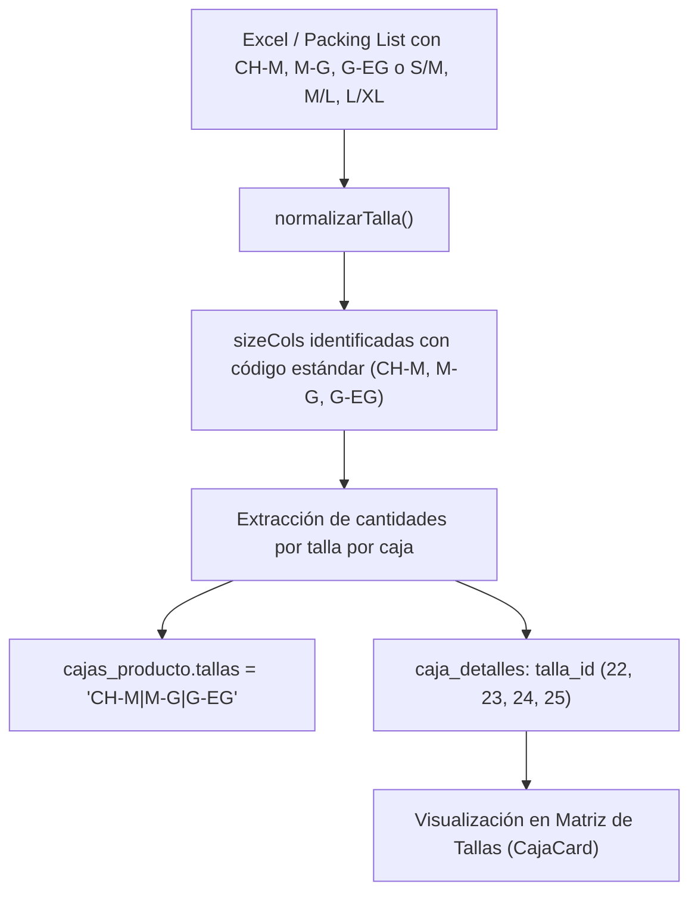

# Plan de Actualización: Soporte de Tallas Dobles en Parsers de n8n

Este documento define el plan técnico para actualizar los flujos y nodos de código en **n8n** (y scripts auxiliares de parsing) para la detección automática y normalización de tallas dobles / compuestas (`CH-M`, `M-G`, `G-EG`, `EG-2EG`).

---

## 1. Contexto y Objetivos

En hojas de packing list de proveedores (como Jackie, American Nice, Honor, etc.), las prendas unisex, conjuntos o pijamas con frecuencia vienen dimensionadas en rangos combinados:
- `CH-M` (o `S/M`, `S-M`, `SM`)
- `M-G` (o `M/L`, `M-L`, `ML`)
- `G-EG` (o `L/XL`, `L-XL`, `LXL`)
- `EG-2EG` (o `XL/2XL`, `XL-XXL`)

Las 4 tallas ya fueron creadas e indexadas en la base de datos `cat_tallas` con IDs 22, 23, 24 y 25.
El objetivo es que los parsers de n8n:
1. **Identifiquen la fila de tallas** aunque contenga únicamente tallas compuestas.
2. **Reconozcan y asocien las columnas de tallas** sin confundirlas con encabezados o texto genérico.
3. **Mapeen las variantes bilingües** (inglés y español) y con diferentes separadores (`-`, `/`, espacios) al código maestro de la BD.

---

## 2. Cambios en el Nodo Parser de n8n (`Code Node`)

### Paso 2.1: Actualizar el Diccionario `tallaMap`

En la sección inicial de mapeo de tallas del nodo de JavaScript en n8n:

```javascript
const tallaMap = {
  // Tallas individuales estándar
  'xs': 'ECH', 'ech': 'ECH', 'exch': 'ECH', 'extra chica': 'ECH',
  's': 'CH', 'ch': 'CH', 'ch/s': 'CH', 's/ch': 'CH', 'chica': 'CH',
  'm': 'M', 'm/m': 'M', 'mediana': 'M',
  'l': 'G', 'g': 'G', 'g/l': 'G', 'l/g': 'G', 'grande': 'G',
  'xl': 'EG', 'eg': 'EG', 'xg': 'EG', 'egxl': 'EG', 'eg/xl': 'EG', 'xl/eg': 'EG', 'extra grande': 'EG',
  'xxl': '2EG', '2xl': '2EG', '2xg': '2EG', '2eg': '2EG', 'eeg': '2EG', 'xxl/2eg': '2EG',
  'xxxl': '3EG', '3xl': '3EG', '3xg': '3EG', '3eg': '3EG',
  '4xl': '4EG', '4xg': '4EG', '4eg': '4EG',
  '5xl': '5EG', '5xg': '5EG', '5eg': '5EG',
  '6xl': '6EG', '6xg': '6EG', '6eg': '6EG',
  'one size': 'UNITALLA', 'onesize': 'UNITALLA', 'unitalla': 'UNITALLA', 'u': 'UNITALLA',
  '0': '0', '2': '2', '3': '3', '4': '4', '5': '5', '6': '6', '8': '8',
  '10': '10', '12': '12', '14': '14', '16': '16',

  // --- TALLAS DOBLES / COMPUESTAS ---
  // CH-M (S/M)
  'ch-m': 'CH-M', 'ch/m': 'CH-M', 'ch_m': 'CH-M', 'chm': 'CH-M',
  's-m': 'CH-M',  's/m': 'CH-M',  's_m': 'CH-M',  'sm': 'CH-M',
  'chica-mediana': 'CH-M', 'small-medium': 'CH-M',

  // M-G (M/L)
  'm-g': 'M-G',   'm/g': 'M-G',   'm_g': 'M-G',   'mg': 'M-G',
  'm-l': 'M-G',   'm/l': 'M-G',   'm_l': 'M-G',   'ml': 'M-G',
  'mediana-grande': 'M-G', 'medium-large': 'M-G',

  // G-EG (L/XL)
  'g-eg': 'G-EG', 'g/eg': 'G-EG', 'g_eg': 'G-EG', 'geg': 'G-EG',
  'g-xg': 'G-EG', 'g/xg': 'G-EG', 'gxg': 'G-EG',
  'l-xl': 'G-EG', 'l/xl': 'G-EG', 'l_xl': 'G-EG', 'lxl': 'G-EG',
  'grande-extra grande': 'G-EG', 'large-xlarge': 'G-EG',

  // EG-2EG (XL/2XL)
  'eg-2eg': 'EG-2EG', 'eg/2eg': 'EG-2EG', 'eg_2eg': 'EG-2EG',
  'xl-2xl': 'EG-2EG', 'xl/2xl': 'EG-2EG', 'xl_2xl': 'EG-2EG',
  'xl-xxl': 'EG-2EG', 'xl/xxl': 'EG-2EG', 'xl_xxl': 'EG-2EG',
  '2xl-3xl': '2EG-3EG', '2xl/3xl': '2EG-3EG',
};
```

---

### Paso 2.2: Ajustar la Función `normalizarTalla(v)`

Garantizar que los caracteres especiales separadores (`/`, `_`, espacios) se homogeneicen a guion (`-`):

```javascript
function normalizarTalla(v) {
  if (v === null || v === undefined) return null;
  const raw = String(v).trim().toLowerCase();
  if (!raw) return null;

  // 1. Coincidencia directa con clave cruda
  if (tallaMap[raw]) return tallaMap[raw];

  // 2. Homogeneizar separadores (/ y _ a -) y remover espacios
  const conGuion = raw.replace(/\s+/g, '').replace(/[\/_]/g, '-');
  if (tallaMap[conGuion]) return tallaMap[conGuion];

  // 3. Remoción completa de separadores (ej. "S/M" -> "sm")
  const compacta = raw.replace(/[^a-z0-9]/g, '');
  if (tallaMap[compacta]) return tallaMap[compacta];

  return null;
}
```

---

### Paso 2.3: Validación de Detección de Fila de Tallas

En la lógica que recorre las filas para encontrar el encabezado de tallas:
- El umbral de detección suele requerir al menos 2 tallas consecutivas o identificadas en la fila.
- Dado que un formato con tallas dobles puede contener solo 3 columnas (como en el ejemplo: `CH-M`, `M-G`, `G-EG`), el detector reconocerá las 3 tallas de inmediato y fijará las columnas `sizeCols`:
  ```javascript
  // Ejemplo: Fila con CH-M (col 4), M-G (col 5), G-EG (col 6)
  // Resultado: sizeCols = [
  //   { col: 4, talla: 'CH-M' },
  //   { col: 5, talla: 'M-G' },
  //   { col: 6, talla: 'G-EG' }
  // ]
  ```

---

## 3. Resumen de Flujo de Datos


