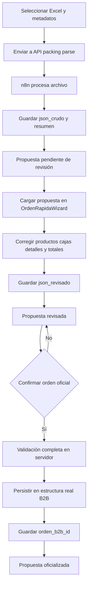

<!-- C:\Users\uriel\Downloads\enero 26\archivo2\plans\plan.md -->
# Plan corregido: cola de Excel, persistencia de JSON n8n y oficialización de Orden Rápida B2B

## 1. Objetivo

Construir un flujo seguro y reutilizable para que Orden Rápida B2B pueda:

1. Recibir uno o varios archivos Excel.
2. Enviar cada archivo a `/api/packing/parse` y n8n sin modificar el workflow de n8n.
3. Guardar permanentemente la respuesta completa y original de n8n en Supabase.
4. Reabrir posteriormente esa respuesta en la interfaz existente de `OrdenRapidaWizard.tsx`.
5. Corregir productos, cajas, matrices, detalles, SKUs y totales sin alterar el JSON original.
6. Guardar una versión revisada de los datos.
7. Confirmar explícitamente la revisión y convertirla una sola vez en una orden oficial usando las estructuras reales del sistema:
   - `contenedores`
   - `productos`
   - `cajas_producto`
   - `caja_detalles`
   - `ordenes_b2b`
   - `ordenes_b2b_detalles`
   - `orden_cajas`
8. Mantener trazabilidad entre la propuesta, el JSON recibido, la revisión humana y la orden oficial creada.

La tabla de propuestas será aditiva. No se modificará n8n ni se tocará directamente `inventario_stock`.

---

## 2. Decisiones de diseño

### 2.1 La tabla debe vivir en el esquema `inv-tienda`

Los clientes Supabase del proyecto están configurados con:

```ts
SUPABASE_SCHEMA = 'inv-tienda'
```

Por lo tanto, la tabla debe crearse como:

```sql
"inv-tienda".packing_list_propuestas
```

No debe crearse en `public`.

### 2.2 El JSON original será inmutable

Se almacenarán dos documentos separados:

- `json_crudo`: respuesta completa y original de n8n. No debe sobrescribirse durante la revisión.
- `json_revisado`: versión canónica construida con las correcciones realizadas en el wizard.

Esto permite:

- Auditar qué respondió n8n.
- Comparar la respuesta con las correcciones humanas.
- Volver a revisar una propuesta sin perder información.
- Oficializar siempre la versión revisada y no datos temporales del navegador.

### 2.3 Revisar y oficializar serán acciones diferentes

El wizard tendrá dos operaciones independientes:

1. **Guardar revisión**
   - Persiste `json_revisado`.
   - Cambia el estado a `REVISADO`.
   - No crea una orden B2B.

2. **Crear orden oficial**
   - Exige una propuesta válida y revisada.
   - Vuelve a validar los datos en el servidor.
   - Usa la lógica oficial de Orden Rápida para escribir en las tablas reales.
   - Guarda `orden_b2b_id` en la propuesta.
   - Cambia el estado a `OFICIALIZADO`.
   - No puede ejecutarse dos veces para la misma propuesta.

### 2.4 La propuesta no es la orden oficial

`packing_list_propuestas` será una bandeja de entrada y revisión. No sustituye `ordenes_b2b` ni sus tablas relacionadas.

Solo cuando el usuario pulse **Crear orden oficial** se enviará la versión revisada al flujo real de persistencia.

---

## 3. Flujo funcional final



---

## 4. Propuesta de tabla Supabase

> Este SQL es un entregable para revisión y ejecución manual. La aplicación no debe ejecutar migraciones automáticamente.

```sql
create table if not exists "inv-tienda".packing_list_propuestas (
  id uuid primary key default gen_random_uuid(),

  -- Idempotencia de cargas y reintentos de la cola
  client_request_id text not null unique,

  -- Documento y configuración usada para procesarlo
  nombre_archivo text not null,
  mime_type text,
  tamano_bytes bigint,
  parser_selector text not null default 'Auto',

  -- Contexto comercial seleccionado por el usuario
  proveedor_id bigint references "inv-tienda".personas(id) on delete restrict,
  proveedor_nombre text,
  cliente_b2b_id bigint references "inv-tienda".personas(id) on delete restrict,
  contenedor_id bigint references "inv-tienda".contenedores(id) on delete set null,
  contenedor_codigo text,

  -- Ciclo de vida de la propuesta
  estado text not null default 'PENDIENTE_REVISION',

  -- Respuesta completa original de n8n; no debe sobrescribirse
  json_crudo jsonb not null default '{}'::jsonb,

  -- Versión canónica guardada después de las correcciones del usuario
  json_revisado jsonb,

  -- Datos derivados para listados sin procesar todo el JSON
  resumen_detectado jsonb,
  warnings jsonb not null default '[]'::jsonb,
  total_productos integer,
  total_cajas integer,
  total_piezas integer,
  cbm_total numeric,
  peso_bruto_total_kg numeric,

  -- Diagnóstico de procesamiento o de oficialización
  error_msg text,

  -- Trazabilidad de usuarios y fechas
  creado_por bigint references "inv-tienda".usuarios(id) on delete set null,
  revisado_por bigint references "inv-tienda".usuarios(id) on delete set null,
  revisado_en timestamptz,
  oficializado_por bigint references "inv-tienda".usuarios(id) on delete set null,
  oficializado_en timestamptz,

  -- Relación idempotente con la orden real
  orden_b2b_id bigint unique references "inv-tienda".ordenes_b2b(id) on delete set null,

  creado_en timestamptz not null default now(),
  actualizado_en timestamptz not null default now(),

  constraint packing_list_propuestas_estado_check check (
    estado in (
      'PENDIENTE_REVISION',
      'REVISADO',
      'OFICIALIZANDO',
      'OFICIALIZADO',
      'ERROR',
      'DESCARTADO'
    )
  ),

  constraint packing_list_propuestas_parser_check check (
    parser_selector in (
      'Auto',
      'MOTI bloques',
      'Jackie/Venkat multi-hoja',
      'Tianyi resumen'
    )
  ),

  constraint packing_list_propuestas_warnings_check check (
    jsonb_typeof(warnings) = 'array'
  ),

  constraint packing_list_propuestas_totales_check check (
    (total_productos is null or total_productos >= 0)
    and (total_cajas is null or total_cajas >= 0)
    and (total_piezas is null or total_piezas >= 0)
    and (cbm_total is null or cbm_total >= 0)
    and (peso_bruto_total_kg is null or peso_bruto_total_kg >= 0)
  ),

  constraint packing_list_propuestas_revision_check check (
    estado not in ('REVISADO', 'OFICIALIZANDO', 'OFICIALIZADO')
    or json_revisado is not null
  ),

  constraint packing_list_propuestas_oficial_check check (
    estado <> 'OFICIALIZADO'
    or (
      orden_b2b_id is not null
      and oficializado_por is not null
      and oficializado_en is not null
    )
  )
);

create index if not exists packing_list_propuestas_estado_fecha_idx
  on "inv-tienda".packing_list_propuestas (estado, creado_en desc);

create index if not exists packing_list_propuestas_proveedor_idx
  on "inv-tienda".packing_list_propuestas (proveedor_id);

create index if not exists packing_list_propuestas_cliente_idx
  on "inv-tienda".packing_list_propuestas (cliente_b2b_id);

create index if not exists packing_list_propuestas_contenedor_idx
  on "inv-tienda".packing_list_propuestas (contenedor_id);

create index if not exists packing_list_propuestas_creado_por_idx
  on "inv-tienda".packing_list_propuestas (creado_por);

alter table "inv-tienda".packing_list_propuestas enable row level security;
```

### 4.1 Confirmaciones necesarias antes de ejecutar el SQL

Verificar mediante Supabase MCP:

- Tipo real de las PK de `personas`, `contenedores`, `usuarios` y `ordenes_b2b`.
- Disponibilidad de `gen_random_uuid()`.
- Convención final de fechas: `creado_en` o `created_at`.
- Políticas RLS existentes para módulos B2B.
- Grants del esquema `inv-tienda` para `authenticated`.
- Funciones disponibles para resolver `auth.uid()` contra `usuarios.auth_user_id`.

### 4.2 RLS requerido

No crear una única política CRUD global para todos los usuarios autenticados.

Las políticas deben separar:

- Lectura: usuario con permiso `b2b_ordenes.puede_leer` y alcance comercial válido.
- Inserción: usuario con `b2b_ordenes.puede_crear`.
- Revisión: usuario con `b2b_ordenes.puede_editar`.
- Descarte: usuario con `b2b_ordenes.puede_eliminar`.
- Oficialización: usuario con `b2b_ordenes.puede_crear` y acceso al proveedor/cliente.

Aunque RLS proteja la tabla, las mismas validaciones se repetirán en Route Handlers y Server Actions.

---

## 5. Contrato del JSON persistido

### 5.1 `json_crudo`

Debe guardar exactamente `result.data`, es decir, la respuesta completa recibida desde n8n antes de aplicar correcciones.

Ejemplo conceptual:

```json
{
  "data": {
    "orden_preview": {},
    "productos_para_editar": [],
    "cajas_para_editar": [],
    "caja_detalles_para_editar": [],
    "warnings": []
  }
}
```

No se debe asumir que n8n siempre responde con un único nivel. Al cargarlo se seguirá usando `unwrapN8nResponse`.

### 5.2 `json_revisado`

La revisión se guardará con una estructura estable y compatible con el adaptador actual:

```json
{
  "version": 1,
  "orden_preview": {
    "estado": "Revisado",
    "total_productos": 10,
    "total_cajas": 50,
    "total_piezas": 600,
    "cbm_orden": 8.25,
    "peso_bruto_total_kg": 900,
    "orden_productos": []
  },
  "productos_para_editar": [],
  "cajas_para_editar": [],
  "caja_detalles_para_editar": [],
  "warnings": [],
  "metadata_revision": {
    "proveedor_id": 18,
    "cliente_b2b_id": 27,
    "contenedor_id": null,
    "contenedor_codigo": "2026-10",
    "parser_selector": "Auto"
  }
}
```

La versión permite evolucionar el formato en el futuro.

### 5.3 Fuente de verdad al reabrir

```ts
const payload = propuesta.json_revisado
  ?? unwrapN8nResponse(propuesta.json_crudo)
```

Si existe revisión, se muestra la revisión. El diálogo **Ver JSON** permitirá consultar por separado:

- JSON original de n8n.
- JSON revisado por el usuario.

---

## 6. Persistencia en `/api/packing/parse`

Archivo actual:

```text
app/api/packing/parse/route.ts
```

### 6.1 Seguridad

La ruta actual no está incluida entre las rutas API protegidas. Se debe elegir una de estas opciones:

- Opción recomendada: moverla a `/api/ordenes-b2b/packing/parse`.
- Opción compatible: añadir `/api/packing` a `PROTECTED_ROUTES`.

Además, el Route Handler debe validar explícitamente:

- Sesión Supabase.
- Usuario interno activo.
- Permiso `b2b_ordenes.puede_crear`.
- Alcance comercial del proveedor y cliente.
- Proveedor existente y de tipo `Proveedor`.
- Cliente existente y de tipo `Cliente B2B`.
- Contenedor existente cuando se envía `contenedor_id`.

### 6.2 Validación del archivo

Validar en cliente y servidor:

- Extensión `.xls` o `.xlsx`.
- MIME permitido cuando esté disponible.
- Tamaño máximo explícito.
- Nombre de archivo no vacío.
- Un archivo por llamada al endpoint.

### 6.3 Idempotencia

El cliente enviará:

```text
client_request_id
```

La ruta debe usarlo para impedir duplicados. Un reintento del mismo item de cola debe recuperar o actualizar la propuesta existente, no insertar otra fila.

### 6.4 Respuesta exitosa

Después de recibir una respuesta válida de n8n:

1. Conservar la respuesta completa en `json_crudo`.
2. Aplicar `unwrapN8nResponse` solo para extraer resumen y warnings.
3. Guardar proveedor, cliente, contenedor, parser y archivo.
4. Insertar o actualizar la propuesta.
5. Devolver el JSON para mantener compatible el wizard actual.

Contrato:

```ts
{
  ok: true,
  propuesta_id: string,
  data: unknown
}
```

La API no debe devolver `ok: true` si n8n respondió correctamente pero el insert en Supabase falló.

### 6.5 Respuesta de error

Si n8n responde con error o ocurre un timeout después de validar la petición:

- Guardar una propuesta con `estado = 'ERROR'`.
- Guardar la respuesta disponible en `json_crudo` o `{}`.
- Guardar un mensaje seguro en `error_msg`.
- Devolver `propuesta_id` cuando la fila se haya podido persistir.

No crear propuestas para errores previos al procesamiento, como falta de sesión, permisos o archivo inválido.

---

## 7. Cola secuencial de Excel

### 7.1 Hook

Crear:

```text
hooks/usePackingQueue.tsx
```

Item mínimo:

```ts
type PackingQueueItem = {
  id: string
  file: File
  proveedorId: number
  proveedorNombre: string
  clienteId: number
  contenedorId: number | null
  contenedorCodigo: string | null
  parserSelector: PackingParserSelector
  status: 'pending' | 'uploading' | 'done' | 'error'
  progress: number
  propuestaId?: string
  errorMsg?: string
  createdAt: number
}
```

Reglas:

- Máximo cinco items activos.
- Una petición a la vez.
- El `id` del item será el `client_request_id`.
- Permitir quitar items pendientes.
- Permitir reintentar errores conservando el mismo ID.
- Al terminar el lote, ejecutar `router.refresh()`.
- Mostrar un único toast por lote, evitando notificaciones duplicadas.
- Acción del toast: abrir `/ordenes-b2b/orden-rapida#propuestas`.

### 7.2 Provider

Registrar `PackingQueueProvider` dentro de `AdminLayoutClient.tsx`, junto al provider OCR, para que la cola sobreviva a navegación interna dentro del shell admin.

La cola seguirá siendo memoria del navegador:

- Sobrevive a navegación interna.
- No sobrevive a una recarga completa.
- Las propuestas ya procesadas sí sobreviven porque están en Supabase.

### 7.3 Modal

Crear:

```text
components/admin/PackingQueueModal.tsx
```

Debe incluir:

- Proveedor obligatorio.
- Cliente B2B obligatorio.
- Contenedor existente o código nuevo.
- Parser: Auto, MOTI, Jackie/Venkat o Tianyi.
- Selector múltiple `.xls,.xlsx`.
- Máximo cinco archivos.
- Nombre y tamaño de cada archivo.
- Estado individual.
- Eliminar item antes de iniciar.
- Botón `Procesar N órdenes en cola`.

`resolverParserSelector` debe extraerse del wizard a un helper compartido para evitar duplicación.

---

## 8. Reutilización de `OrdenRapidaWizard`

### 8.1 No duplicar el pipeline de adaptación

Extraer del wizard funciones puras para:

- `resolverParserSelector`.
- `unwrapN8nResponse`.
- `adaptarN8nAWizard`.
- Deduplicar productos por SKU.
- Construir `json_revisado`.

Ubicación sugerida:

```text
modules/ordenes-b2b/packing-list.ts
```

El helper debe ser utilizable desde servidor y cliente; no debe importar APIs exclusivas del navegador.

### 8.2 Entrada del wizard

La página leerá:

```text
?propuesta_id=<uuid>
```

`page.tsx` ejecutará directamente `fetchPackingPropuestaById`. No se necesita Server Action para la lectura inicial.

Props propuestas:

```ts
type WizardProps = {
  proveedores: PersonaRow[]
  clientes: PersonaRow[]
  contenedores: ContainerOption[]
  marcas?: MarcaOption[]
  propuesta?: PackingListPropuesta | null
}
```

Para evitar conservar estado al cambiar de propuesta:

```tsx
<OrdenRapidaWizard
  key={propuesta?.id ?? 'nueva'}
  propuesta={propuesta}
  {...catalogos}
/>
```

### 8.3 Inicialización en modo propuesta

Cuando existe una propuesta:

1. Usar `json_revisado` o `json_crudo` según corresponda.
2. Adaptar el JSON con el mismo pipeline del procesamiento normal.
3. Inicializar proveedor, cliente y contenedor.
4. Inicializar productos, cajas, detalles y warnings.
5. Inicializar overrides de totales.
6. Verificar SKUs contra Supabase.
7. Saltar al paso 3.
8. Mostrar badge con ID corto, archivo y estado.

### 8.4 Acciones del paso final

En modo de propuesta, el paso 4 debe ofrecer:

- **Guardar revisión**.
- **Crear orden oficial**, habilitado únicamente después de superar todas las validaciones.

La creación de la orden deberá incluir una confirmación clara indicando que se escribirán datos reales de productos, cajas y orden B2B.

Una propuesta `OFICIALIZADO` será de solo lectura y mostrará un enlace a su orden.

---

## 9. Guardar revisión

Crear Server Action:

```ts
actualizarPackingPropuestaAction(input)
```

Responsabilidades:

1. Exigir usuario autenticado.
2. Exigir `b2b_ordenes.puede_editar`.
3. Consultar la propuesta y validar alcance comercial.
4. Rechazar propuestas `OFICIALIZANDO`, `OFICIALIZADO` o `DESCARTADO`.
5. Validar estructura y límites del payload.
6. Construir `json_revisado` en servidor o validar el formato canónico recibido.
7. Recalcular los totales derivados en servidor.
8. Actualizar:
   - `json_revisado`
   - `resumen_detectado`
   - `warnings`
   - totales
   - `estado = 'REVISADO'`
   - `revisado_por`
   - `revisado_en`
   - `actualizado_en`
9. Ejecutar `revalidatePath('/ordenes-b2b/orden-rapida')`.

No debe modificar `json_crudo`.

---

## 10. Oficialización en las tablas reales

### 10.1 Acción propuesta

Crear una acción específica:

```ts
oficializarPackingPropuestaAction(propuestaId: string)
```

No enviar nuevamente todos los productos y cajas desde el navegador. La acción debe leer `json_revisado` desde Supabase para que la versión persistida sea la fuente de verdad.

### 10.2 Validaciones previas

La acción debe:

1. Exigir `b2b_ordenes.puede_crear`.
2. Cargar la propuesta por ID.
3. Validar alcance comercial.
4. Verificar `estado = 'REVISADO'`.
5. Verificar `orden_b2b_id is null`.
6. Validar proveedor y cliente.
7. Validar que existan productos y cajas.
8. Validar SKUs no vacíos y sin duplicados.
9. Validar códigos de caja no vacíos.
10. Validar cantidades, piezas, pesos, dimensiones y CBM no negativos.
11. Validar que cada caja tenga un SKU resoluble.
12. Validar coherencia entre productos, cajas y detalles.
13. Recalcular totales en servidor.

### 10.3 Bloqueo lógico e idempotencia

Antes de comenzar, cambiar el estado de forma condicional:

```text
REVISADO -> OFICIALIZANDO
```

La actualización debe incluir un filtro por el estado anterior y `orden_b2b_id is null`. Si no actualiza una fila, otra petición ya está oficializando o la propuesta ya fue procesada.

Al finalizar:

```text
OFICIALIZANDO -> OFICIALIZADO
```

Guardar:

- `orden_b2b_id`
- `oficializado_por`
- `oficializado_en`
- `actualizado_en`

Si falla antes de crear la orden, volver a `REVISADO` y guardar `error_msg`.

Si falla después de escrituras parciales, no se debe marcar automáticamente como disponible para reintento hasta determinar qué registros se crearon.

### 10.4 Reutilización de la acción existente

Actualmente `guardarOrdenRapidaB2BAction` realiza:

1. Resolver o crear contenedor.
2. Resolver, crear o actualizar productos.
3. Resolver tallas y colores.
4. Crear o actualizar cajas.
5. Reemplazar `caja_detalles` de cada caja.
6. Crear `ordenes_b2b`.
7. Crear `ordenes_b2b_detalles`.
8. Crear `orden_cajas`.

La lógica debe extraerse a una función de servidor reutilizable, por ejemplo:

```ts
async function persistirOrdenRapidaB2B(payload, contexto)
```

Después:

- `guardarOrdenRapidaB2BAction` podrá seguir usándola para carga directa.
- `oficializarPackingPropuestaAction` la usará con datos leídos de `json_revisado`.

### 10.5 Riesgo actual de atomicidad

La acción existente ejecuta múltiples operaciones independientes. Si una operación intermedia falla, pueden quedar:

- Contenedores creados.
- Productos creados o actualizados.
- Cajas modificadas.
- Detalles de caja reemplazados.
- Una orden sin todos sus detalles o relaciones.

Antes de usarla como promoción definitiva se debe elegir una estrategia:

#### Opción recomendada

Crear una función transaccional en PostgreSQL e invocarla mediante:

```ts
supabase.rpc('nombre_fn', payload)
```

Esto requiere revisar cuidadosamente el contrato y ejecutar el SQL manualmente.

#### Opción temporal

Mantener la acción actual, registrar con precisión la fase que falló y bloquear reintentos automáticos cuando puedan existir escrituras parciales.

La opción temporal permite avanzar, pero no ofrece la misma garantía de integridad.

### 10.6 Riesgo de sobrescritura de datos maestros

La implementación actual:

- Actualiza nombre, descripción, composición y marca de productos existentes.
- Hace `upsert` de cajas por `codigo_caja`.
- Elimina y vuelve a crear todos los `caja_detalles` de una caja existente.

Antes de oficializar se debe definir explícitamente:

- Si una propuesta puede modificar productos existentes.
- Si una caja existente debe actualizarse o solo reutilizarse.
- Si sus detalles pueden reemplazarse.
- Qué hacer si el mismo código de caja pertenece a otro proveedor o producto.

Recomendación inicial:

- No actualizar automáticamente productos existentes salvo campos autorizados.
- No reemplazar detalles de una caja existente sin confirmación o validación de proveedor/producto.
- Tratar conflictos de código como error revisable, no como sobrescritura silenciosa.

---

## 11. Tabla de propuestas

Crear:

```text
components/admin/PackingPropuestasTable.tsx
```

Columnas:

- Archivo.
- Proveedor.
- Cliente.
- Contenedor.
- Parser.
- Productos.
- Cajas.
- Piezas.
- Estado.
- Warnings.
- Fecha con `<Fecha>`.
- Orden oficial, cuando exista.
- Acciones.

Acciones por estado:

### `PENDIENTE_REVISION`

- Cargar en wizard.
- Ver JSON original.
- Descartar.

### `REVISADO`

- Continuar revisión.
- Ver JSON original.
- Ver JSON revisado.
- Crear orden oficial.
- Descartar.

### `ERROR`

- Ver error.
- Ver JSON disponible.
- Reintentar archivo desde la cola si el archivo sigue disponible localmente.
- Descartar.

### `OFICIALIZANDO`

- Solo lectura.
- Mostrar indicador de proceso.
- No permitir acciones duplicadas.

### `OFICIALIZADO`

- Ver JSON original.
- Ver JSON revisado.
- Abrir orden oficial.
- No permitir editar ni oficializar nuevamente.

### `DESCARTADO`

- Solo lectura o filtrado fuera de la vista principal.

La paginación usará un parámetro independiente:

```text
?propuestas_page=2
```

---

## 12. Queries, actions y tipos

### Queries

En `modules/ordenes-b2b/queries.ts`:

```ts
fetchPackingPropuestas(filtros)
fetchPackingPropuestaById(id)
```

Ambas deben aplicar permisos y alcance comercial.

### Actions

En `modules/ordenes-b2b/actions.ts` o en un archivo específico del submódulo:

```ts
actualizarPackingPropuestaAction(input)
descartarPackingPropuestaAction(id)
oficializarPackingPropuestaAction(id)
```

No se recomienda eliminar físicamente una propuesta ya revisada u oficializada. `DESCARTADO` conserva auditoría.

### Tipos

Después de ejecutar el SQL se deben regenerar los tipos Supabase y definir:

```ts
export type PackingListPropuesta =
  Database['inv-tienda']['Tables']['packing_list_propuestas']['Row']

export type PackingListPropuestaInsert =
  Database['inv-tienda']['Tables']['packing_list_propuestas']['Insert']

export type PackingListPropuestaUpdate =
  Database['inv-tienda']['Tables']['packing_list_propuestas']['Update']
```

No usar `(supabase as any)` como solución permanente.

---

## 13. Integración en la página

Actualizar:

```text
app/(admin)/ordenes-b2b/orden-rapida/page.tsx
```

La página deberá:

1. Validar `requirePermission('b2b_ordenes')`.
2. Resolver `searchParams` de Next.js 16.
3. Cargar catálogos en paralelo.
4. Cargar la propuesta seleccionada cuando exista `propuesta_id`.
5. Renderizar el botón de cola en el encabezado.
6. Renderizar el wizard.
7. Renderizar la tabla debajo del wizard dentro de `<Suspense>`.

Añadir:

```text
app/(admin)/ordenes-b2b/orden-rapida/loading.tsx
```

El skeleton debe cubrir encabezado, wizard y tabla.

---

## 14. Orden de implementación

### Fase 0: respaldo y confirmación de base

1. Revisar el estado de Git.
2. Crear punto de restauración solo con autorización explícita.
3. Consultar la base real mediante Supabase MCP.
4. Confirmar tipos, FK, RLS y grants.

### Fase 1: esquema y tipos

1. Ajustar el SQL definitivo.
2. El usuario ejecuta el SQL.
3. Regenerar `database.types.ts`.
4. Crear tipos de dominio y schemas de validación.

### Fase 2: helpers compartidos

1. Extraer parser selector.
2. Extraer unwrap de n8n.
3. Extraer adaptación al wizard.
4. Extraer deduplicación.
5. Implementar constructor de `json_revisado`.
6. Añadir pruebas unitarias para respuestas envueltas de n8n.

### Fase 3: persistencia del resultado n8n

1. Proteger el Route Handler.
2. Añadir validación de archivo y metadatos.
3. Añadir `client_request_id`.
4. Persistir éxito y error.
5. Mantener respuesta `{ ok, propuesta_id, data }`.

### Fase 4: cola

1. Crear hook y provider.
2. Crear modal.
3. Añadir barra o indicador persistente.
4. Verificar máximo cinco y concurrencia uno.

### Fase 5: revisión persistente

1. Crear queries.
2. Cargar propuesta desde `searchParams`.
3. Inicializar wizard en paso 3.
4. Guardar `json_revisado`.
5. Permitir reabrir la revisión.

### Fase 6: oficialización

1. Auditar y tipar `guardarOrdenRapidaB2BAction`.
2. Extraer la persistencia reutilizable.
3. Definir política segura para productos y cajas existentes.
4. Implementar bloqueo `OFICIALIZANDO`.
5. Crear la orden real.
6. Vincular `orden_b2b_id`.
7. Bloquear doble oficialización.

### Fase 7: tabla y experiencia final

1. Crear tabla paginada.
2. Añadir diálogo de JSON original/revisado.
3. Añadir estados y acciones contextuales.
4. Añadir enlaces a la orden oficial.
5. Añadir skeleton de ruta.

### Fase 8: validación

1. Ejecutar `pnpm typecheck`.
2. Ejecutar `pnpm lint`.
3. Ejecutar pruebas unitarias/integración específicas.
4. Realizar pruebas manuales del flujo completo.

---

## 15. Casos de prueba obligatorios

### Captura

- Excel `.xls` válido.
- Excel `.xlsx` válido.
- Extensión inválida.
- Archivo demasiado grande.
- Respuesta n8n válida.
- Respuesta n8n envuelta en `data`, `json`, `body`, `response` o arreglo.
- Respuesta n8n no JSON.
- HTTP de error de n8n.
- Timeout.
- Reintento con el mismo `client_request_id`.

### Cola

- Un archivo.
- Cinco archivos.
- Intento de agregar un sexto.
- Error del segundo archivo sin detener los demás.
- Reintento de un error.
- Navegación interna mientras continúa la cola.
- Un solo toast al finalizar el lote.

### Revisión

- Abrir propuesta pendiente.
- Guardar correcciones.
- Recargar navegador y recuperar correcciones.
- Cambiar de una propuesta a otra.
- Comparar JSON original y revisado.
- Detectar SKU duplicado.
- Detectar caja sin SKU.
- Detectar diferencias de piezas.

### Oficialización

- Oficializar propuesta revisada válida.
- Intentar oficializar una pendiente sin revisión.
- Doble clic o dos peticiones simultáneas.
- Intentar oficializar una ya oficializada.
- Fallo al crear producto.
- Conflicto con caja existente.
- Fallo después de crear la cabecera de orden.
- Usuario sin permiso de creación.
- Usuario fuera del alcance comercial.
- Verificar vínculo entre propuesta y `ordenes_b2b`.

---

## 16. Criterios de aceptación

El trabajo estará completo cuando:

- Cada respuesta exitosa de n8n quede guardada íntegramente en `json_crudo`.
- Los errores de n8n queden registrados como propuestas `ERROR` cuando corresponda.
- Un mismo `client_request_id` no genere propuestas duplicadas.
- La interfaz existente pueda abrir una propuesta sin volver a enviar el Excel.
- Las correcciones se guarden en `json_revisado` sin alterar `json_crudo`.
- La revisión sobreviva a recargas y nuevas sesiones.
- El usuario pueda volver a editar una propuesta `REVISADO`.
- La oficialización use la revisión persistida como fuente de verdad.
- La orden oficial se cree en las tablas B2B reales.
- La propuesta guarde el `orden_b2b_id` creado.
- Una propuesta no pueda oficializarse dos veces.
- Las acciones respeten autenticación, permisos y alcance comercial.
- La tabla permita consultar JSON original, revisión y orden resultante.
- `pnpm typecheck` y `pnpm lint` terminen sin errores causados por esta implementación.

---

## 17. Resultado esperado

El resultado será una bandeja persistente de Packing Lists procesados por n8n. El Excel dejará de ser una operación temporal del navegador: su JSON original quedará almacenado, podrá revisarse con la interfaz ya existente y las correcciones podrán guardarse antes de afectar datos oficiales.

La creación de la orden real será una acción explícita, auditable e idempotente. La propuesta conservará la relación entre:

```text
Excel -> respuesta n8n -> revisión humana -> orden B2B oficial
```
